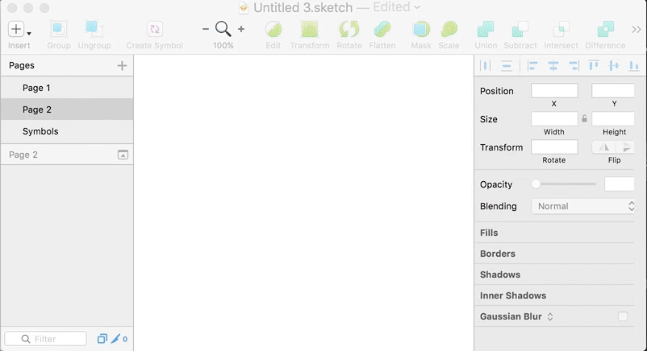
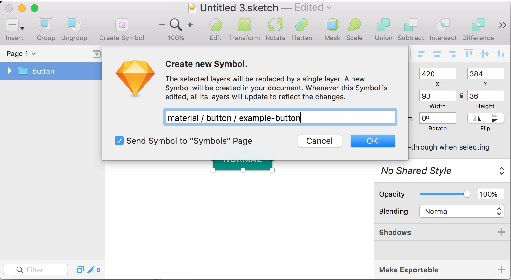
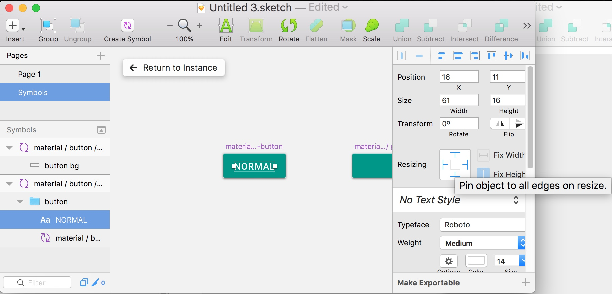
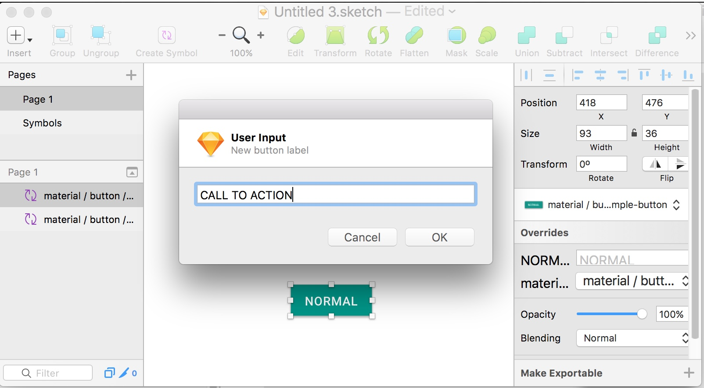
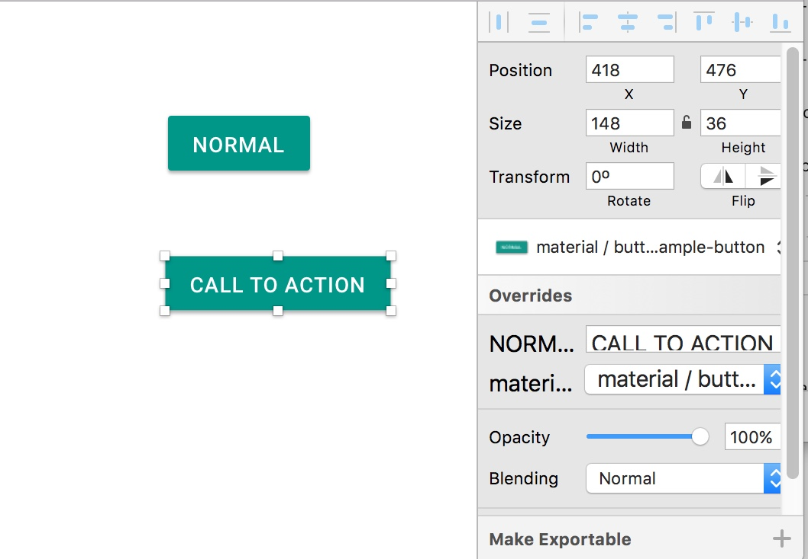
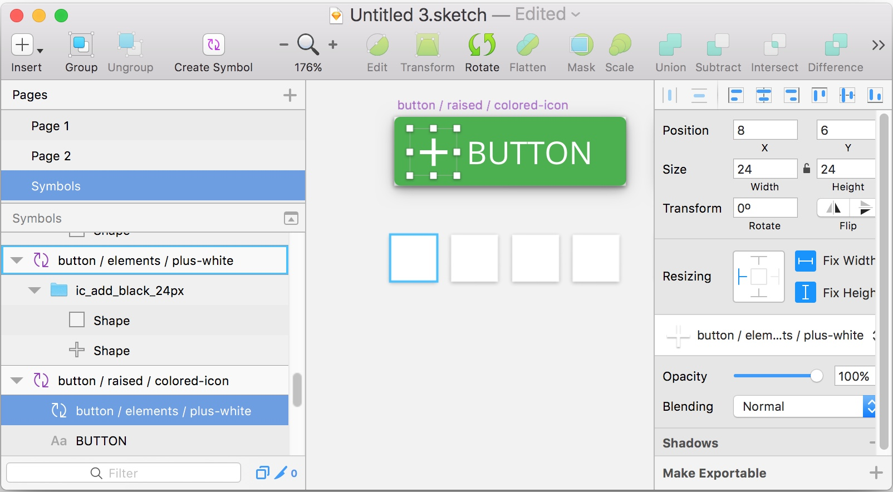

title: Sketch App - A (better) responsive button using Symbols
description: I show you how to make buttons better
date: June 2017
tags: tag1, tag two, tag 3#, tag 4%, tag $#!
category: test
topImage: 
content:
# The Problem
There have been many articles written trying to solve the problem of making consistent buttons within a Sketch file. Problems with these methods include:
- Not being able to measure the actual distance between button elements and other elements on the page
- Inconsistent "padding" between the centered text of the button and its edges
- Not using Sketch symbols at all, and preventing file-level changes to the buttons later on

[relative link](resources/D45B734A6197112E9F7EF285005C9C92.gif)
[External link](https://google.com)
As designers, we must ensure that our hi-fi mockups and prototypes are both pixel-perfect and quick to build. In some cases, these demands require a trade-off between one or the other. Since the introduction of the "Pin on resize" feature in Sketch (and thanks to a plugin or two), we can build our mockups/prototypes quickly and _consistently_ - avoiding confusion in user tests and downstream development.

# A Better Solution

# What You'll Need
- Sketch 44.1 (or later)
(previous versions might break "pinning" in symbols)
- Button (by Ken Moore)
- Optional: Artboard Tricks OR Craft Library (to keep things organized)

# How To
First, make your ideal button. As an example, I'll copy the material design one:

## Creating the Symbol Button
Then, create a symbol out of the button:

Double-click the button to navigate to it on the symbol page. Select its background and create another symbol out of it:

To finish up your symbol, click the text in the middle and change its **Resizing** properties to "Pin object to all edges on resize":

## Using the Symbol Button
Go ahead and create a new button by inserting from your symbols list:

Then, use the "Button" plugin (CMD+J) to change the text and width of the button:

Clicking "OK" will change the _Text_ property in the symbol's **Overrides** and resize the button to keep a consistent padding between the text and the button edges!

Pretty cool right?

## Changing the Button's Color
Symbol Overrides also let you change the color of the button quickly and easily. To do so, simply copy the `base` color you made earlier and change its color:

Then, navigate to the Button whose color you'd like to change, and change its `base` in **Overrides**:

_Viola_ a blue button!

## Buttons with Icons
For buttons with icons, you can follow a similar pattern, just make sure you pin your elements correctly:

For a button with an icon on the left, enable "Pin object to the left edge on resize" for the icon. All of the other settings for your button can remain the same.

**To be able to switch out the icons, make sure their symbols are all the same size.**

Here is an example of it in action:

Combine the ability to switch out icons with your color/text switching workflows and you've got a pretty slick set of key strokes to quickly build consistent UI elements!

# Keeping Organized (optional)
Once you've created a variety of buttons, bases, and colors, it can get cumbersome to keep everything organized. To lighten the load of managing your symbols, I recommend following the naming conventions outlined by NAME in ARTICLE.

Sometimes, you may need to find a particular symbol visually, rather than in a list. For this case, I recommend using Artboard Tricks by Roman Nurik to sort your artboards into a grid and move them into an organized layout. Luckily, Sketch made selecting and moving artboards easier by making that the default selection method.

Alternatively, InVision's Craft also provides a great alternative to keeping your symbols organized with Library. This adds an extra UI overlay to easily sort and filter your symbols, as well as share them across your organization:

# Did I miss something?
Is there a use-case I didn't capture in this blog post? Maybe you were wondering if you can use the Button plugin for other text elements like Tooltips or Toast notifications (hint: you can). Please let me know in the comments below!

